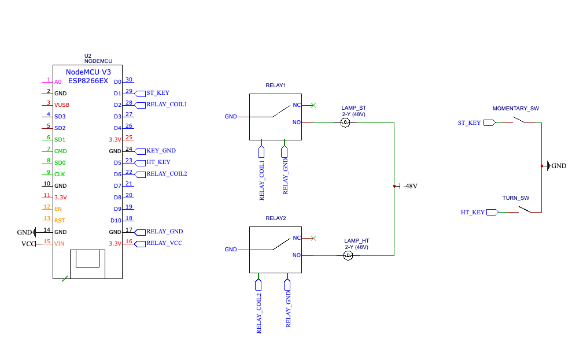

# tinyrobot
A small set of Lua scripts for panel_gen and [nodeMCU](https://en.wikipedia.org/wiki/NodeMCU)

This provides a key and lamp so volunteers can start the [panel_gen](https://github.com/theautumn/panel_gen) demo during tours. The nodeMCU polls the key pin every 100ms, and polls the API every 1 sec. When the key is operated, a POST is made to the API, which starts the call generator. Another keypress turns it off.

Notes:
-----
This is a 3v3 microcontroller / relay setup. Since this is running in a telephone CO, the positive side of the battery is grounded and the "hot" terminal is at -48V. Don't use frame ground for things that are hooked up to the microcontroller unless you know what you are doing!
